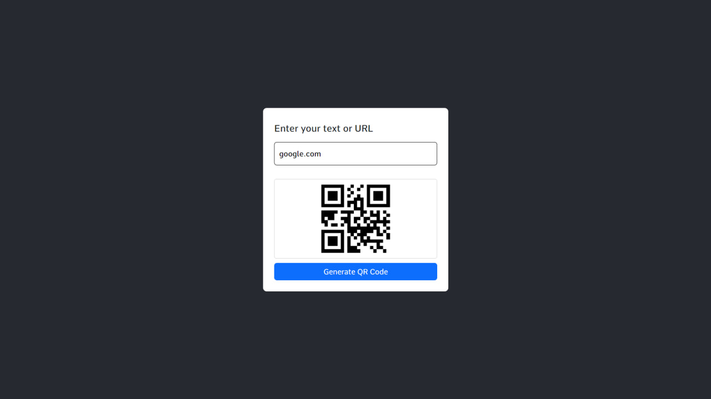
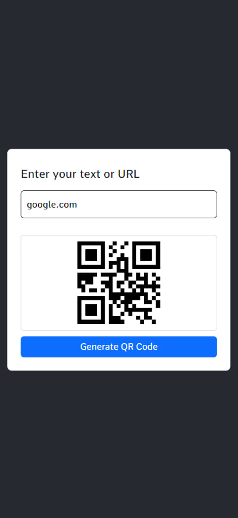

# Frontend Qr-code-generator Project
My_Frontend || Project-22

## Screenshots
<table>
    <tr>
        <td>
            
        </td>
        <td>
            
        </td>
    </tr>
</table>

## Demo

[Live Demo](https://frontend-projects-22.netlify.app)

## Tech Stack

- HTML
- CSS
- JavaScript
- Bootstrap5
- Responsive

## Authors

- [T.Oqilbek](https://www.github.com/tolqinov-o)

### My Qr-code-generator Demo Link

```
https://frontend-projects-22.netlify.app
```